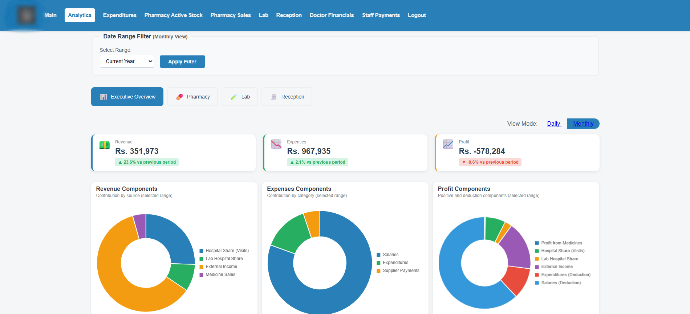
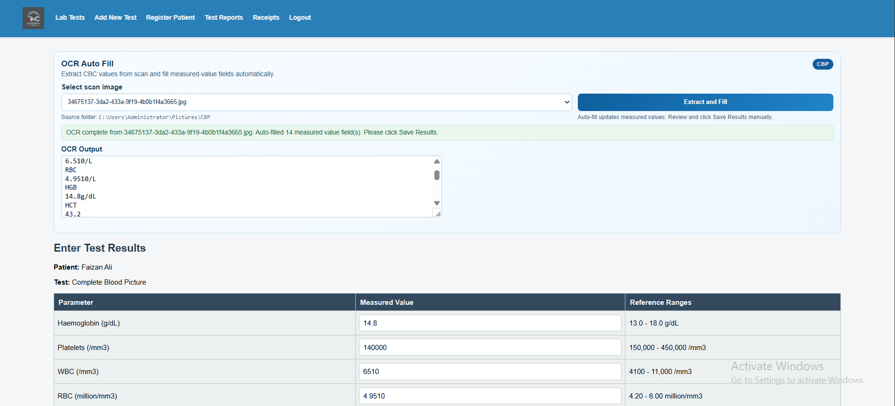
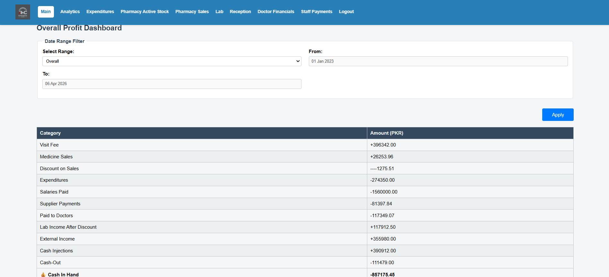
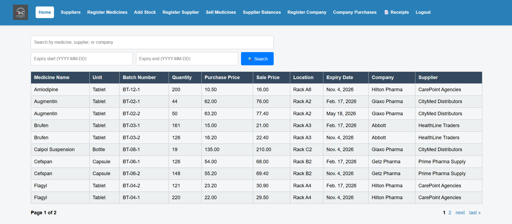
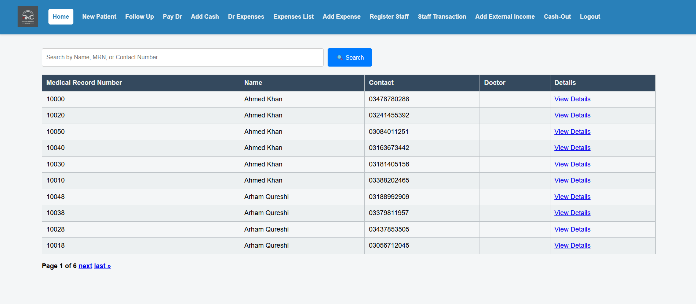

# Healthcare Operations Intelligence Platform

A healthcare operations platform for hospitals, labs, pharmacies, and clinics, with a strong focus on OCR-assisted lab automation and management dashboards for data-driven decision making.

## Overview

This project is designed to unify day-to-day healthcare operations across diagnostic workflows, pharmacy processes, patient handling, and financial monitoring.

It goes beyond record keeping. The platform is built to reduce manual work, improve operational visibility, and support faster decisions with analytics-driven insights.

## What It Solves

Healthcare operations often suffer from fragmented tools, repetitive manual entry, and limited visibility into financial and departmental performance. This platform addresses those gaps by combining operational workflows with AI-assisted data capture and management analytics.

## Core Capabilities

- Patient registration and clinic workflow support
- Lab test registration, reporting, and result entry
- OCR-assisted extraction of lab values from scanned slips
- Pharmacy inventory, purchasing, sales, and return workflows
- Revenue, expense, payout, and transaction tracking
- Executive and department-level dashboards for operational insights

## Screenshots

### Analytics Dashboard

Shows executive and department-level visibility for revenue, profit, operations, and healthcare performance tracking.

### OCR-Assisted Lab Result Entry

Shows the OCR workflow for scanned CBC / Complete Blood Picture slips and automatic filling of measured-result fields.

### Management Dashboard

Shows the main operational control view for hospital, lab, pharmacy, and clinic management.

### Pharmacy Operations

Shows medicine inventory, purchasing, sales, and operational pharmacy workflows.

### Patient Workflow

Shows patient registration, checkup flow, or clinic-side workflow handling.

## OCR-Assisted Lab Automation

One of the strongest parts of this platform is its OCR-assisted lab workflow.

Instead of manually typing every value from a CBC or Complete Blood Picture slip, staff can use scan-based extraction to identify relevant values and place them into the appropriate measured-result fields. This reduces repetitive data entry and helps accelerate reporting workflows.

### OCR Workflow Highlights

- Scan-based extraction of lab values from diagnostic slips
- Automatic mapping of extracted values to measured-result fields
- Support for derived values and count calculations
- Human review before final confirmation
- Faster turnaround for lab reporting workflows

This part of the system reflects practical document AI and computer vision applied to real healthcare operations.

## Analytics and Decision Support

The platform includes advanced management dashboards built for operational visibility and decision support.

These dashboards provide insights across:

- revenue and profit performance
- pharmacy purchasing and sales activity
- lab operations and test-related financials
- patient/checkup activity
- expenditures and cash movement
- doctor-related financial views
- staff transaction tracking

The goal is to help healthcare operators move from manual tracking to data-driven operational management.

## Why This Project Matters

This is not positioned as a generic hospital software product. It represents a combination of:

- workflow automation
- AI-assisted document understanding
- operational analytics
- healthcare-focused decision support

That combination makes it relevant for modern hospitals, labs, clinics, and pharmacies that want both execution efficiency and operational intelligence.

## Best Fit

This type of solution is relevant for:

- hospitals
- diagnostic laboratories
- outpatient clinics
- pharmacies
- healthcare groups managing multi-department operations

## Selected Value Areas

- Reduced manual entry in lab result workflows
- Better visibility into department-wise performance
- Improved tracking of revenue, profit, and expenditures
- More reliable operational reporting for management teams
- Stronger alignment between healthcare workflows and AI-assisted automation

## My Role

I built and extended this platform with a focus on:

- healthcare workflow design
- OCR-assisted diagnostic data capture
- analytics and dashboard-driven decision support
- practical AI integration for operational software

This project reflects my work at the intersection of AI engineering, computer vision, workflow automation, and domain-specific software systems.

## Public Showcase Note

This repository is presented as a portfolio and product showcase. It focuses on business value, workflow capability, and AI integration rather than exposing production code or implementation-sensitive details.

## Contact

If you are looking for help with healthcare software, OCR/document understanding, computer vision integration, analytics dashboards, or AI-assisted workflow automation, this project is representative of that capability.
